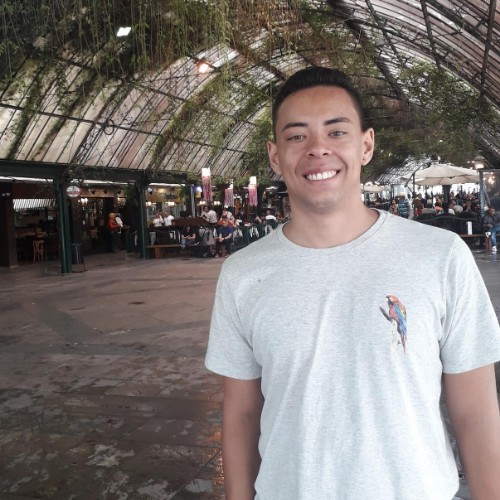

<p align="center">  </p>

O projeto a ser desenvolvido vai ser um sistema para agendamentos de eventos na [Casa Oracle](https://blogs.oracle.com/oracle-brasil/casa-oracle-abre-as-portas-para-a-inovacao-em-sao-paulo) buscando solucionar os obstáculos da pandemia do [Covid-19](https://covid.saude.gov.br/).

<h2 align="center">🚧  Sistema 🚀 Em construção...  🚧</h2>

<p align="center">
  

  

  <a href="https://github.com/tgmarinho/README-ecoleta/commits/master">
    
  </a>
    
   
 
   <a href="https://github.com/API-4-SEMESTRE/PROJETO-API/stargazers">
    
  </a>
</p>

<h2>Tópicos 🏁</h2>

<p>
 <a href="#projeto-">Projeto</a> •
 <a href="#desafio-">Desafio</a> • 
 <a href="#entregas-">Entregas</a> •
 <a href="#Rodando-o-Sistema-">Rodar o sistema</a> •
 <a href="#tecnologias-">Tecnologias</a> •
 <a href="#membros-">Membros</a> • 
 <a href="#licença-">Licença</a> • 
</p>

<h2>Projeto 🖥</h2>

Projeto realizado em parceria com a Oracle Corporation uma empresa que atua na área da Computação e Informática juntamente com a Faculdade de Tecnologia de São José dos Campos Professor Jessen Vidal.

<h2>Desafio 📈</h2>

Desafio proposto pela Oracle Corporation - "No escritório de São Paulo, temos um espaço de inovação aberta chamado Casa Oracle, que é um local para realização de eventos internos/externos, workshops e palestras. Dentro do contexto das restrições sanitárias, nosso desafio é criar uma plataforma para o gerenciamento da utilização do espaço, onde nossos colaboradores poderão fazer a solicitação de agendamento, definindo os convidados e recursos necessários para o evento."

<h2>Entregas 💎</h2>

O planejamento e o progresso durante as Sprints do projeto poderá ser visto em [Entregas](https://github.com/API-4-SEMESTRE/PROJETO-API/wiki/Entregas).

<h2>Rodando o Sistema 🚀</h2>

### Pré-requisitos

Antes de começar, você vai precisar ter instalado em sua máquina as seguintes ferramentas:
[Git](https://git-scm.com), [Node.js](https://nodejs.org/en/), [NPM](https://www.npmjs.com/), [Java 11](https://www.java.com/pt-BR/), [Vue.js](https://vuejs.org/) e [Maven](https://maven.apache.org/). 
Além disto é bom ter um editor para trabalhar com o código como [VSCode](https://code.visualstudio.com/) ou [IntelliJ](https://www.jetbrains.com/pt-br/idea/).

### 🎲 Rodando o Back-End

```bash
# Clone este repositório
$ git clone https://github.com/API-4-SEMESTRE/PROJETO-API

# Descompactar o arquivo chamado "wallet_API4SEMORACLE" em alguma pasta da sua preferência. O caminho da pasta aonde foi descompactado o Wallet vai ser usado mais a frente.

# Acesse a pasta "PROJETO-API/Sistema/api-back" do projeto no terminal/cmd

# Abrir o arquivo "application.properties" no caminho "mvn\src\main\resources\application.properties"

# Dentro do arquivo "application.properties", aonde estiver escrito "[URL]" apagar e colocar "jdbc:oracle:thin:@api4semoracle_medium?TNS_ADMIN=" + caminho da pasta aonde o Wallet foi descompactado

# Exemplo de como deve ficar: jdbc:oracle:thin:@api4semoracle_medium?TNS_ADMIN=/Users/nome/Downloads/wallet

# Onde estiver "[USER]" e "[PASSORD]" deve colocar o usuário e a senha

# Salvar o arquivo "application.properties"

# Vá na pasta descompactada da Wallet e abra o arquivo "ojdbc.properties"

# Comente a segunda linha (adicione "#" no começo dela)

# Vai ficar assim: # oracle.net.wallet_location=(SOURCE=(METHOD=FILE)(METHOD_DATA=(DIRECTORY=${TNS_ADMIN})))

# Descomente as 4 últimas linhas (retire o "#" delas)

# Vai ficar assim:
javax.net.ssl.trustStore=${TNS_ADMIN}/truststore.jks
javax.net.ssl.trustStorePassword=<password_from_console>
javax.net.ssl.keyStore=${TNS_ADMIN}/keystore.jks
javax.net.ssl.keyStorePassword=<password_from_console>

# Nessas 4 linhas, no final delas, aonde estiver escrito "<password_from_console>", apague e coloque a mesma senha do Banco de Dados usada no application.properties

# Vai ficar assim:
javax.net.ssl.trustStore=${TNS_ADMIN}/truststore.jks
javax.net.ssl.trustStorePassword=senha_teste
javax.net.ssl.keyStore=${TNS_ADMIN}/keystore.jks
javax.net.ssl.keyStorePassword=senha_teste

# Salvar o arquivo "ojdbc.properties"

# Rodar o arquivo "ApiBackApplicartion.java" no seu editor de código ou IDE

# O Back-end está rodando e o Banco de Dados na Oracle Cloud está conectado
```

### 🎲 Rodando o Front-End

```bash
# Clone este repositório (caso ainda não tenha clonado)
$ git clone https://github.com/API-4-SEMESTRE/PROJETO-API

# Ir para a pasta "Sistema/api-front" e rodar o camando a seguir no terminal para instalar as dependências do NPM
$ npm install

# Ainda na pasta "Sistema/api-front" rodar com o comando a seguir para rodar o Front-end
$ npm run serve

# O Front-end está rodando, acesse o link do servidor do Vue.js
```

<h2>Tecnologias 🛠</h2>

As seguintes ferramentas foram usadas na construção do projeto:

<a href="https://vuejs.org/">
  
</a>
<a href="https://www.java.com/pt-BR/">
  
</a>
<a href="https://www.oracle.com/br/cloud/">
  
</a>
<a href="https://www.atlassian.com/software/jira">
  
</a>
<a href="https://git-scm.com/">
  
</a>
<a href="https://nodejs.org/en/">
  
</a>
<a href="https://www.npmjs.com/">
  
</a>
<a href="https://maven.apache.org/">
  
</a>
<a href="https://spring.io/projects/spring-boot">
  
</a>

<h2>Membros 👥</h2>

<table>
    <tr>
        <td align="center">
            <a href="https://linkedin.com/in/tairik-nishimura/">
                
                <br />
                <sub>
                    <b>Tairik Johnny</b>
                </sub>
            </a>
            <br />
            <a href="https://linkedin.com/in/tairik-nishimura/" title="Tairik">Scrum Master</a>
            <br />
        </td>
        <td align="center">
            <a href="https://www.linkedin.com/in/rafaela-carnaval-70a506138/">
                
                <br />
                <sub>
                    <b>Rafaela Aparecida</b>
                </sub>
            </a>
            <br />
            <a href="https://www.linkedin.com/in/rafaela-carnaval-70a506138/" title="Rafaela">Product Owner</a>
            <br />
        </td>
        <td align="center">
            <a href="https://linkedin.com/in/wallace-caetano/">
                
                <br />
                <sub>
                    <b>Wallace Caetano</b>
                </sub>
            </a>
            <br />
            <a href="https://linkedin.com/in/wallace-caetano/" title="Wallace">Front-end Developer</a>
            <br />
        </td>
    </tr>
    <tr>
        <td align="center">
            <a href="https://www.linkedin.com/in/fabricioadriel/">
                
                <br />
                <sub>
                    <b>Fabrício Adriel</b>
                </sub>
            </a>
            <br />
            <a href="https://www.linkedin.com/in/fabricioadriel/" title="Fabricio">Front-end Developer</a>
            <br />
        </td>
        <td align="center">
            <a href="https://linkedin.com/in/devanir-ramos-junior/">
                
                <br />
                <sub>
                    <b>Devanir Ramos</b>
                </sub>
            </a>
            <br />
            <a href="https://linkedin.com/in/devanir-ramos-junior/" title="Devanir">Back-end Developer</a>
            <br />
        </td>
        <td align="center">
            <a href="https://www.linkedin.com/in/breno-m-52a300141">
                
                <br />
                <sub>
                    <b>Breno Gabriel</b>
                </sub>
            </a>
            <br />
            <a href="https://www.linkedin.com/in/breno-m-52a300141" title="Breno">Back-end Developer</a>
            <br />
        </td>
    </tr>
    <tr>
        <td align="center">
            <a href="linkedin.com/in/alex-costa-ba3439187">
                
                <br />
                <sub>
                    <b>Alex Costa</b>
                </sub>
            </a>
            <br />
            <a href="linkedin.com/in/alex-costa-ba3439187" title="Alex">Back-end Developer</a>
            <br />
        </td>
        <td align="center">
            <a href="https://www.linkedin.com/in/alan-bezerra/">
                
                <br />
                <sub>
                    <b>Alan Lucas</b>
                </sub>
            </a>
            <br />
            <a href="https://www.linkedin.com/in/alan-bezerra/" title="Alan">Database Developer</a>
            <br />
        </td>
        <td align="center">
            <a href="www.linkedin.com/in/gabriel-timoteo-santos">
                
                <br />
                <sub>
                    <b>Gabriel Timoteo</b>
                </sub>
            </a>
            <br />
            <a href="www.linkedin.com/in/gabriel-timoteo-santos" title="Gabriel">Database Developer</a>
            <br />
        </td>
    </tr>
</table>

<h2>Licença 📝</h2>

Este projeto esta sobe a licença [MIT](./LICENSE).
